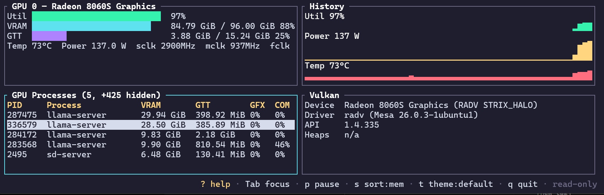
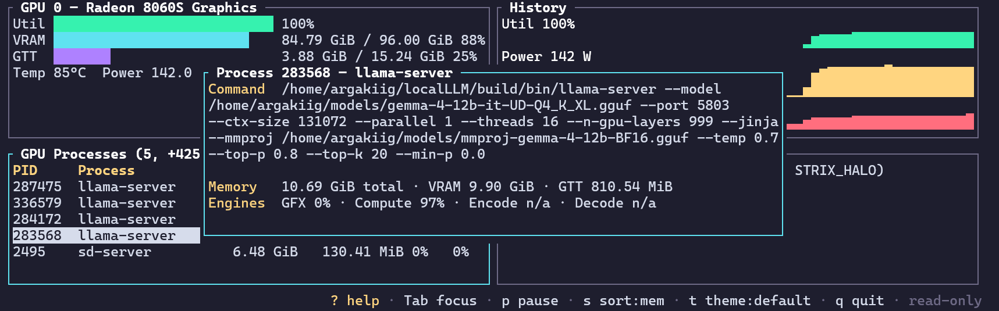

# xrocmtop

[](https://github.com/argakiig/xrocmtop/actions/workflows/ci.yml)

A [`btop`](https://github.com/aristocratos/btop)-style terminal UI for monitoring AMD ROCm and Vulkan GPUs from the CLI.

`xrocmtop` is not meant to replace `nvtop`, `amdgpu_top`, or `rocm-smi` for everyone. It is a focused, hackable view of the AMD GPU, APU, and unified-memory signals I personally wanted easier access to.

It includes live gauges, scrolling history graphs, a per-process GPU table, a Vulkan device panel, and an SMU metrics panel covering the rest of the APU that a GPU-only view can miss: CPU cores, NPU visibility where available, unified-memory bandwidth, hotspot temperatures, and live throttle reasons.

It is built for AMD GPUs and APUs, with unified-memory parts treated as a first-class case.



## Why

AMD GPU monitoring already has useful tools, including `nvtop`, `amdgpu_top`, and `rocm-smi`. I still wanted something narrower and easier to bend toward the hardware I actually run.

For my Strix Halo setup, I kept wanting an always-on TUI that put the APU-specific signals front and center: VRAM vs GTT, unified-memory behavior, per-process usage, clocks, power, thermals, throttle reasons, Vulkan visibility, and the platform metrics that are easy to lose when a tool is mostly thinking “discrete GPU.”

So `xrocmtop` is not a claim that the existing tools are bad. It is the view I wanted while testing local LLM workloads on AMD APUs, built as a small Rust binary I could own, change, and extend.

`xrocmtop` is deliberately:

* **Hackable.** A single small Rust binary, no plugin layer, no config DSL to fight. Each panel is a pure function of app state, fixture-tested, and easy to fork. Add a column, a panel, or a metric without spelunking through a large framework. The whole thing is built to be edited, not just used.
* **Focused on real signals.** Per-process **VRAM vs GTT** split, per-engine utilization, full command lines, and the clocks, power, memory, and thermal signals that actually matter during real workloads.
* **APU-first.** Unified-memory parts, where “VRAM” is carved from system RAM alongside a separate GTT pool, are treated as a first-class case rather than an afterthought.
* **Honest and unprivileged.** Read-only, no root required for the core view, and every unsupported metric renders as `n/a` instead of pretending the data exists.

## Install

Requires a Rust toolchain, stable channel. Builds to a single self-contained binary.

```sh
# Install straight from the repo onto your PATH:
cargo install --git https://github.com/argakiig/xrocmtop

# Or build from a local clone:
git clone https://github.com/argakiig/xrocmtop && cd xrocmtop
cargo build --release
./target/release/xrocmtop      # run in place
cargo install --path .         # or install onto your PATH
```

Prebuilt Linux binaries, including glibc and static musl builds, are attached to each [GitHub Release](https://github.com/argakiig/xrocmtop/releases). Download the tarball for your target, verify the `.sha256`, and drop `xrocmtop` on your `PATH`.

## Requirements

* Linux with the `amdgpu` driver.
* Access to `/sys/class/drm/cardN/device/...`.
* **No root required** for the core view. Metrics are read as a normal user where the kernel exposes them.
* Optional external tools, each used only if present:

  * `rocm-smi`: fills static identity fields such as device name, VBIOS, and IDs.
  * `vulkaninfo`: populates the Vulkan device panel.

The tool degrades gracefully when optional tools or unsupported metrics are missing.

## Usage

```text
xrocmtop [OPTIONS]

  -i, --interval <MS>   Refresh interval in milliseconds       [default: 1000]
      --gpu <INDEX>     Restrict the view to a single GPU index
      --no-vulkan       Hide the Vulkan device panel
      --no-procs        Hide per-process GPU accounting
      --history <N>     Samples retained for history graphs    [default: 240]
      --once            Print a single snapshot and exit
      --json            With --once, emit JSON instead of text
  -h, --help / -V, --version
```

## Keys

| Key                    | Action                                                          |
| ---------------------- | --------------------------------------------------------------- |
| `q` / `Esc` / `Ctrl-C` | Quit and restore the terminal cleanly                           |
| `?`                    | Toggle the help overlay                                         |
| `Tab`                  | Focus the next panel                                            |
| `[` `]` / `←` `→`      | Move the focused panel earlier or later in the layout           |
| `↑` `↓` / `j` `k`      | Select a process row when the Processes panel is focused        |
| `Enter`                | Open the detail popup for the selected process                  |
| `Esc` / any key        | Close the process detail popup                                  |
| `1` `2` `3` `4` `5`    | Toggle the Gauges / Graphs / Metrics / Processes / Vulkan panel |
| `t`                    | Cycle the color theme                                           |
| `p`                    | Pause or resume refreshing                                      |
| `s`                    | Cycle the process-table sort: memory → pid → name               |

Panel layout, hidden panels, and the chosen theme are saved automatically on exit and restored on the next launch.

## Customization

Colors and layout live in `~/.config/xrocmtop/config.toml`.

`xrocmtop` respects `XDG_CONFIG_HOME`. The file is written for you when you customize the UI at runtime, but you can also hand-edit it. Bad values are ignored rather than fatal.

```toml
# Built-in preset: "default", "high-contrast", or "mono".
# Cycle live with `t`.
theme = "default"

# Optional per-element overrides applied on top of the preset.
# Values are named colors or hex values.
[colors]
util_bar = "#00d7af"
vram_bar = "cyan"
gtt_bar  = "blue"
focus    = "lightcyan"
accent   = "yellow"

# Also supported:
# border, title, text, dim, footer,
# graph_util, graph_power, graph_temp

# Panel order and hidden panels.
# Managed by the toggle and move keys, but editable.
order  = ["gauges", "graphs", "metrics", "processes", "vulkan"]
hidden = []
```

## Scripting

`--once` makes `xrocmtop` a plain reporter instead of a TUI. This is useful for cron jobs, dashboards, quick checks, or scripts.

```sh
xrocmtop --once
xrocmtop --once --json
xrocmtop --once --json --no-procs --no-vulkan | jq '.gpus[0].mem'
```

The JSON output is intended to be stable enough for scripts.

## What it shows

### Per GPU

* Utilization.
* VRAM used, total, and percent.
* GTT used, total, and percent.
* Edge temperature.
* Package power.
* SCLK, MCLK, FCLK, and SOCCLK clocks.

### History graphs

Rolling sparklines for:

* Utilization.
* Power.
* Temperature.

### Processes

The Processes panel shows each process holding an `amdgpu` DRM handle.

For each process, `xrocmtop` shows:

* PID.
* Process name.
* GPU memory usage split into **VRAM** and **GTT**.
* Per-engine utilization for **GFX** and **compute** in the table.
* Full command line in the detail view.
* Encode and decode utilization in the detail view where available.
* Per-`drm-client-id` breakdown in the detail view.

Engine percentages are averaged over the time between process walks and show as `n/a` until a process has been seen twice.

Processes that cannot be inspected without elevation are summarized as `+N hidden`.

Press `Enter` on a process row to open the detail popup.



### Vulkan

The Vulkan panel shows:

* Device name.
* Driver.
* API version.
* Device-local memory heaps.

### SMU and platform metrics

Where available, the Metrics panel surfaces APU/platform signals such as:

* CPU core visibility.
* NPU visibility.
* Unified-memory bandwidth.
* Hotspot temperatures.
* Throttle and limit reasons.

Hardware and kernel support vary. Unsupported metrics render as `n/a`.

## FAQ

### Why not just use nvtop?

You probably should, if `nvtop` already shows what you need.

`xrocmtop` exists because I wanted a more APU-focused view for Strix Halo and similar unified-memory systems, especially around VRAM vs GTT, platform metrics, per-process usage, and a layout I can quickly modify.

### Does this replace rocm-smi?

No.

`rocm-smi` is useful, but I wanted an always-on TUI rather than a one-shot text dump. `xrocmtop` uses `rocm-smi` opportunistically for static identity fields when it is present, but the core view comes from `amdgpu` sysfs and `/proc`.

### Does this support the NPU?

Only where reliable platform metrics are available.

`xrocmtop` is still GPU/APU-first. If the NPU or another platform metric is not exposed in a way the tool can read safely, it shows `n/a` instead of guessing.

### Do I need this if I already use nvtop, amdgpu_top, or btop?

Maybe not.

If your current tools already show the signals you care about, keep using them. I built `xrocmtop` because I wanted the AMD APU-specific pieces I kept checking to be easier to see in one place.

### Why build another monitor?

Because local tools are allowed to be personal.

This started as a way to watch the hardware I actually run while testing LLM workloads. It is shared in case the same view is useful to other people running AMD APUs.

## Design and safety

* **Read-only.** The tool only reads `/sys` and `/proc`. It never writes sysfs and never changes clocks, power caps, fan curves, or performance profiles.
* **No root for core metrics.** The core view runs as a normal user.
* **Tiered data sources.**

  * `amdgpu` sysfs every tick.
  * `/proc` for process accounting.
  * `rocm-smi` at a low cadence for static identity fields.
  * `vulkaninfo` once at startup for Vulkan device details.
* **Graceful degradation.** Missing or unsupported metrics show as `n/a`.
* **Low overhead.** Single binary, single-threaded refresh loop, and cheap reads for the main path.

See [`SPEC.md`](SPEC.md) for the full specification, including architecture, data sources, and the criteria for done.

## Development

```sh
cargo test
cargo clippy --all-targets -- -D warnings
cargo fmt --all
```

Parsers are tested against fixtures captured from real hardware under `tests/fixtures/`, including deliberately degraded inputs to prove graceful `n/a` handling.

CI runs on every push and pull request:

* Format check.
* Clippy with warnings treated as errors.
* Test suite.
* Release build.

Pushing a `v*` tag triggers the release workflow, which builds stripped glibc and static musl binaries and publishes them to a GitHub Release.

Contributions are welcome. See [`CONTRIBUTING.md`](CONTRIBUTING.md) for project boundaries, the pre-commit gate, and the real-hardware fixture rule.

Notable changes are recorded in [`CHANGELOG.md`](CHANGELOG.md).

## Scope

Current scope:

* AMD GPUs and APUs using `amdgpu`.
* Local machine monitoring.
* Read-only visibility.
* Linux.

Not in scope for v1:

* NVIDIA support.
* Intel support.
* Remote or fleet monitoring.
* GPU control.
* Fan control.
* Power cap management.
* Clock management.
* OS packaging.

These are deliberate boundaries, not accidental omissions.

## License

MIT. See [`LICENSE`](LICENSE).
